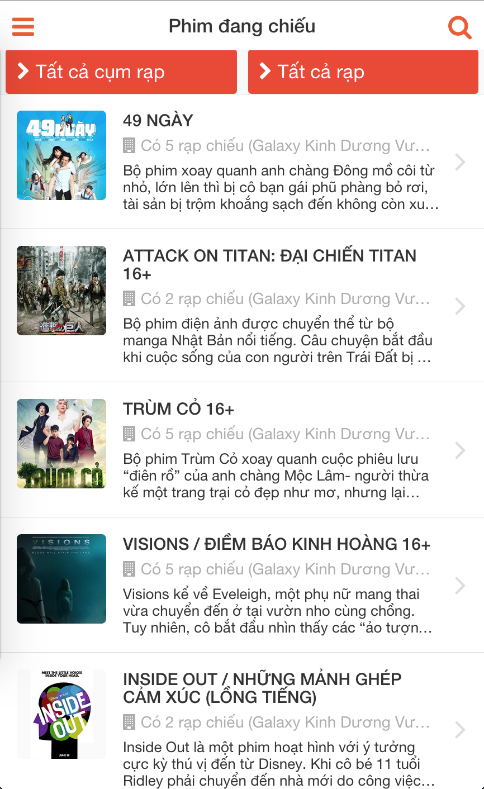
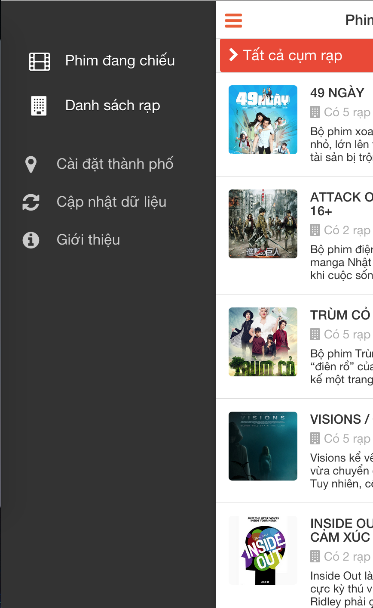

# Movie showtimes
Web &amp; Android Application to look up Vietnam movie showtimes

# Team

- Đinh Quang Trung
- Nguyễn Ngọc Thanh Hải
- Phạm Thị Thu Hòa

# What it looks like





# Requirement

Web / Mobile App
----

Features:
- See all movies available now (all theater or with theater filter)
- Showtimes by theater, or movies, or date
- Search by movie name
- Theater detail (name, address, map, images...)
- Movie detail (name, description, poster, trailer...)


Crawler
----
- Crawler schedule: everyday (movies, showtimes, theater) or manually
- Target site data change: must have mechanism to change old invalid data

# Architecture


# Entities


Cinema
------
- name
- website_link

Theater
-------
- name
- description
- city
- address
- map_link
- image
- cinema

Movie
-----
- name
- description
- poster
- trailer
- show_date
- length
- genre
- director
- actor
- age_restriction
- audio_type (lồng tiếng / vietsub)
- video_type (2D / 3D / 4DX)

Session
-------
- show_datetime
- movie
- theater


# API

API:
- `/getMovies&city={city}`: return all movies which have sessions in `{city}`

XML Schema:

```xml
  <xs:schema version="1.0" 
           xmlns:xs="http://www.w3.org/2001/XMLSchema"
           elementFormDefault="qualified"
           targetNamespace="http://www.fpt.edu.vn"
           xmlns="http://www.fpt.edu.vn">
    
    <xs:simpleType name="show-time" >
        <xs:restriction base="xs:int">
            <xs:minInclusive value="0"/>
        </xs:restriction>
    </xs:simpleType>
    
    <xs:simpleType name="youtube-url">
        <xs:restriction base="xs:string">
            <xs:pattern value="(https://)?(www\.youtube\.com/watch\?v).*" />
        </xs:restriction>
    </xs:simpleType>
       
    <xs:complexType name="Theater">
        <xs:sequence>
            <xs:element name="cinema" type="xs:string" use="required"/>
            <xs:element name="name" type="xs:string" use="required"/>
            <xs:element name="description" type="xs:string"/>
            <xs:element name="city" type="xs:string" use="required"/>
            <xs:element name="address" type="xs:string"/>
            <xs:element name="map_link" type="xs:string"/>
            <xs:element name="image" type="xs:string" use="required"/>
        </xs:sequence>
    </xs:complexType>
    
    <xs:complexType name="Session">
        <xs:sequence>
            <xs:element name="id" type="xs:integer" use="required"/>
            <xs:element name="show_time" type="show-time" use="required"/>
            <xs:element name="movie" type="xs:string" use="required"/>
            <xs:element name="theater" use="required" type="Theater">          
            </xs:element>
        </xs:sequence>
    </xs:complexType>
    
    <xs:complexType name="Movie">
        <xs:sequence>
            <xs:element name="id" type="xs:integer" use="required"/>
            <xs:element name="name" type="xs:string" use="required"/>
            <xs:element name="description" type="xs:string"/>
            <xs:element name="poster" type="xs:string" use="required"/>
            <xs:element name="trailer" type="youtube-url"/>
            <xs:element name="show_date" type="show-time"/>
            <xs:element name="length" type="xs:string"/>
            <xs:element name="genre" type="xs:string"/>
            <xs:element name="director" type="xs:string"/>
            <xs:element name="actor" type="xs:string"/>
            <xs:element name="age_restriction" type="xs:string"/>
            <xs:element name="audio_type" type="xs:string"/>
            <xs:element name="video_type" type="xs:string"/>
            <xs:element name="sessions" use="required">
                <xs:complexType>
                    <xs:sequence>
                        <xs:element name="session" maxOccurs="unbounded" type="Session">                           
                        </xs:element>
                    </xs:sequence>
                </xs:complexType>
            </xs:element>
        </xs:sequence>
    </xs:complexType>

    <xs:element name="movies">
        <xs:complexType>
            <xs:sequence>
                <xs:element name="movie" maxOccurs="unbounded" type="Movie">
                </xs:element>
            </xs:sequence>
        </xs:complexType>
    </xs:element>
    
  </xs:schema>
```

# Development

- Maven build for all java projects
- Netbeans IDE 7.4
- Java Web Applications: 
    - Apache Tomcat 7.0.57
    - Java JDK 6
    - Java EE 6 Web


# Deployment

Bookmark URLs:
-
- CI Web Client: http://jbossews-trungdq88.rhcloud.com/
- CI Web Service: http://jbossews-trungdq88.rhcloud.com/API/getMovies?city=
- MongoDB GUI: https://jbossews-trungdq88.rhcloud.com/rockmongo/
- Openshift repository (require ssh authen): `ssh://54cb1bebfcf93359b800017d@jbossews-trungdq88.rhcloud.com/~/git/jbossews.git/`


MongoDB
-
**Connection:**
Use this configuration to connect to MongoDB in CI:

        String host = System.getenv("OPENSHIFT_MONGODB_DB_HOST");
        String sport = System.getenv("OPENSHIFT_MONGODB_DB_PORT");

**Authentication:**
- Root User:     admin
- Root Password: (check message)
- Database Name: jbossews

**Management GUI:**
- URL: https://jbossews-trungdq88.rhcloud.com/rockmongo/
- RockMongo User: admin
- RockMongo Password:(check message)

Deploy:
-
1. From Openshift git repository, pull code changes

     `git pull github master`

2. Merge conflicts if there is any

3. Push code to CI

     `git push openshift master`

4. Check the console message to see if the build is success

Crawl new data:
-
Connect SSH to the server

    rhc ssh jbossews

Move to deployed directory

    cd /var/lib/openshift/54cb1bebfcf93359b800017d/app-root/runtime/repo/crawler-app/target/

Start the crawler

    java -jar crawler-app-1.0-jar-with-dependencies.jar galaxy cgv bhd

That's it.

